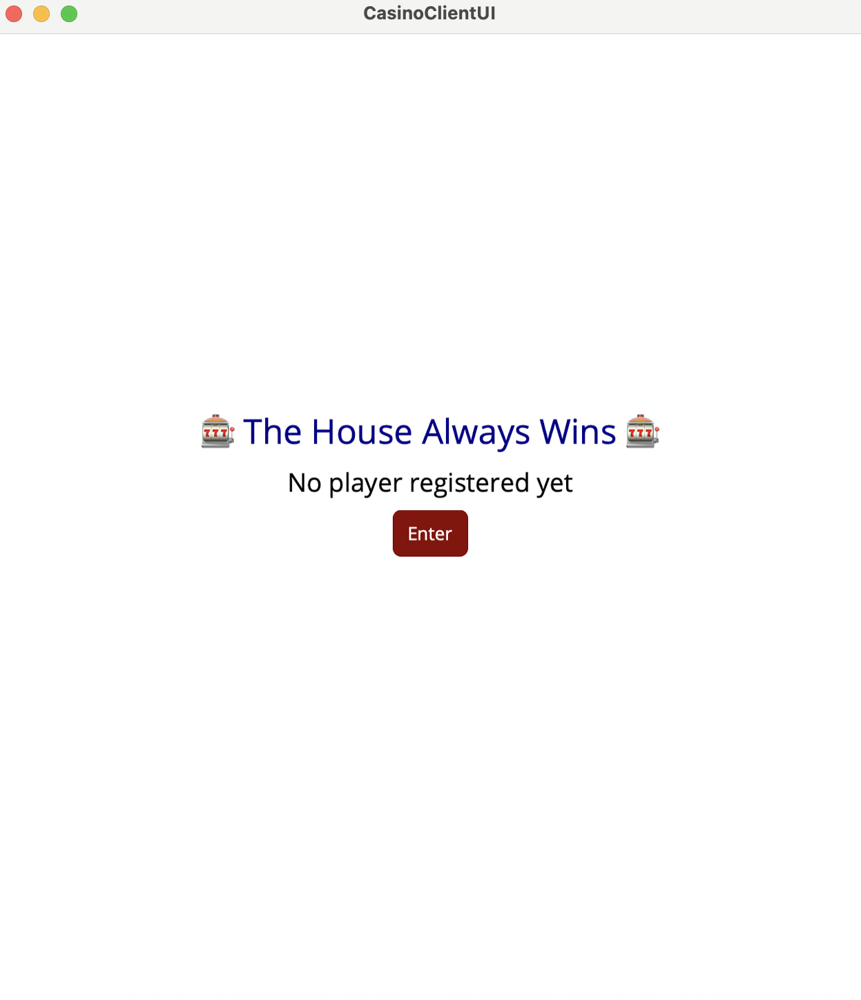

# Casino MAUI Project – Build and Run Guide

This guide explains how to build, run, and test the **Casino MAUI Project**, which contains two projects:

- **CasinoServer** – the backend server.
- **CasinoClientUI** – the .NET MAUI client application.
---

## Prerequisites

Before you start, ensure you have the following installed:

1. **.NET 9 SDK**  
2. **Xcode** (for MAUI iOS/macCatalyst builds)  
   Install Xcode and its command-line tools:  
      xcode-select --install

# Building and Running the Server
1. Open a terminal and navigate to the directory containg both CasionClientUI and CasionServer projects
2. Build the server project
    dotnet build --project CasinoServer
3. Run the Server:
    dotnet run --project CasinoServer "http://127.0.0.1:5000"
# Building and Running the Client (MAUI)
1. Open a new terminal
2. Build the client project:
    dotnet build --project CasinoClientUI
3. Run the MAUI client (MacCatalyst target):
    dotnet build -t:Run -f net9.0-maccatalyst
(Note: MAUI on macOS requires Xcode. Ensure all Xcode tools are installed.)

# Running the tests
To run tests for the server, you need to launch two server instances:
1. Terminal 1 – normal server:
    dotnet run --project CasinoServer "http://127.0.0.1:5000"
2. Terminal 2  - test server (supposed to reprent a client):
    dotnet run -- --test --project CasinoServer "http://127.0.0.1:5001"
This will excute all the tests and output results on the terminal (tests the server without the UI client)

# Screenshots:

